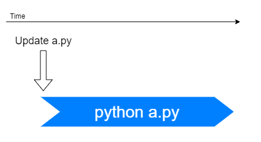
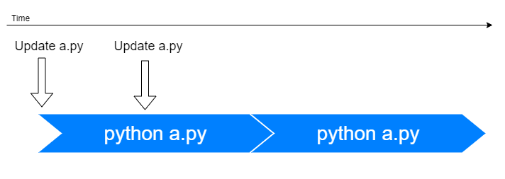
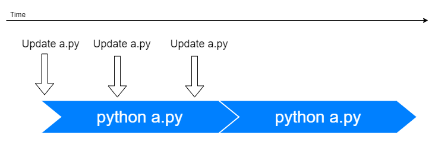
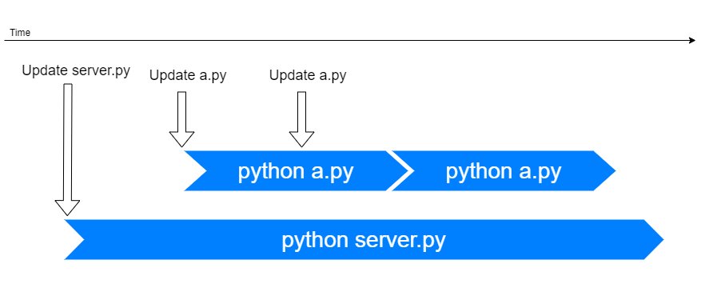

# Parallel handling

Gaze deals with multiple processes nicely.

## The most simple case

1. You update a.py
2. Gaze invokes `python a.py`
3. `python a.py` finishes



No controversial point.

## Update twice in a row

In case you update a.py again during the first process stay running, what should occur?

- Gaze waits until the first process finishes.
- Right after the first process finished, a second process launches.



Since a.py was modified after the first `python a.py` launched, running `python a.py` again after the first process finished is a natural behavior.

## Update more than twice in a row

In case you update a.py **multiple times** during the first process stay running, what should occur?

- Gaze waits until the first process finishes.
- Right after the first process finished, a second process launches.
- (Gaze does NOT launch third process)



Note that **Gaze doesn't invoke the third process** in this case. Since there is no update after the second launch, not invoking a third process is natural behavior as a development purpose tool.

## Update multiple files

Gaze deals with multiple processes nicely.

In case you update another file during the first process stay running, what should occur? **Gaze runs a second process**.



Since you may develop multiple files and one might keep running for a long time, this is also natural behavior as a development purpose command.

## Update multiple files but run one command

There is a case Gaze runs the same command even when different files are updated. In this case, Gaze invokes the same command `make` when any .go file was updated.

```
gaze -c make '*.go'
```

What should happen when you update multiple \*.go files during the first `make` stay running? The answer is below.


**Gaze manages processes by commands, NOT files**. Since the same command is specified for any files, Gaze waits until the first `make` finished in this case. Right after the first `make` finished, the next `make` launches.
